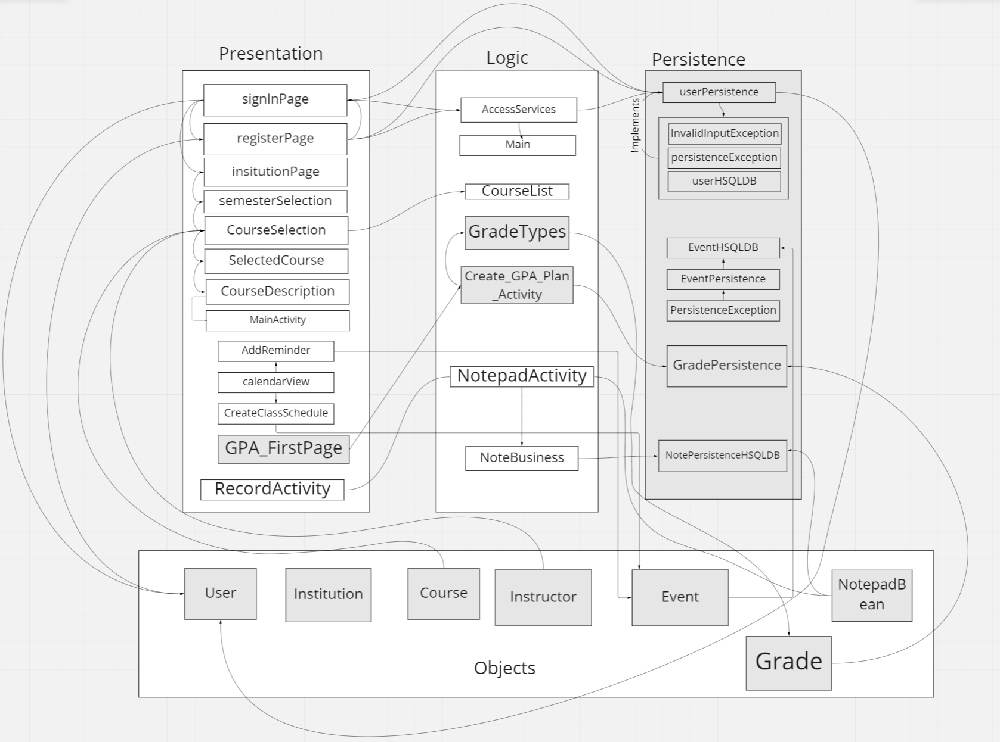

<<<<<<< ARCHITECTURE.md
## Sources and Packages
The Sources and Packages used for iteration 1 are listed below.

- package com.example.coursemanager;
- import android.content.Intent;
- import android.os.Bundle;
- import android.widget.ArrayAdapter;
- import android.widget.Button;
- import android.widget.EditText;
- import android.widget.ListView;
- import androidx.appcompat.app.AppCompatActivity;
- import java.io.BufferedReader;
- import java.io.IOException;
- import java.io.InputStream;
- import java.io.InputStreamReader;
- import java.util.ArrayList;
- import android.widget.TextView;
- import android.os.Parcel;
- import android.os.Parcelable;
- import java.util.regex.Matcher;
- import java.util.regex.Pattern;
- import android.view.View;
- import android.view.WindowManager;
- import sun.bob.mcalendarview.MCalendarView;
- import sun.bob.mcalendarview.listeners.OnDateClickListener;
- import sun.bob.mcalendarview.vo.DateData;
- import comp3350.studymanager.Object.User;

## Architecture Diagram

>>>>>>> ARCHITECTURE.md
