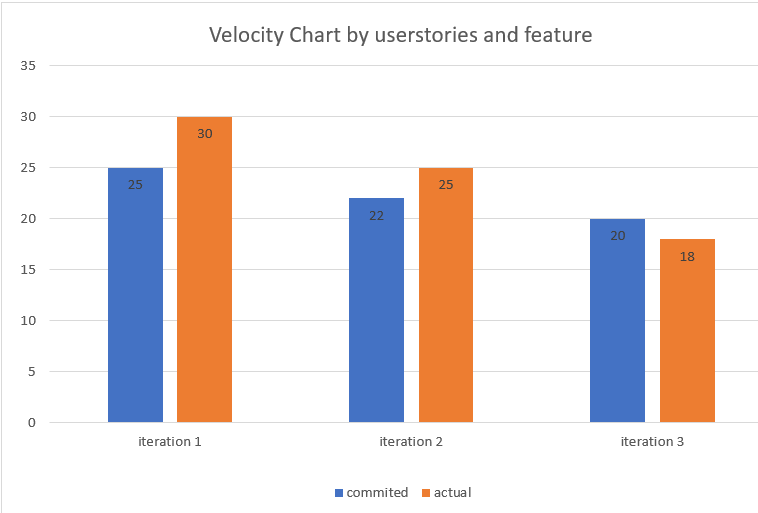

## Retrospective
Before, the way we use gitlab is just a place to upload and store data. We alway download and push the changed file directly to gitlab, which was such a bad way and having so many problem. For example, since everyone download the project instead of making a new branch, no one would ever know what the other member is has done, and when 2 people push their changed object to gitlab, we are losing some files almost every single time. Also, if someone made a bug to the program, there is no way other than re-push the other working file once again to roll back this bug.

So, this time we figured the right way which is using the branching operation to pull the project down, edit it then push to a branch. Once we make sure everything works perfect, then we merge it into main branch, so that we would not face the risk of lossing files and no need to worry able new bugs.

This is going to be evaluated success if we do not lossing any files during iteration 3, and do not need to re-push any back up files to branch main to fix irreparable bugs.

Also, for the merging operation, we used to start merging all our projects 2 to 3 days before the due date, which almost impossible for us to fix all the merging bugs during this amount of time. In iteration 1 and iteration 2  every team member stayed up late when the due date was coming, which was so frustrated both physically and mentally. So, this time, we agreed to start merging all the existing pieces as early as possible, which not only reduce the amount of works each time when we are going to merge anything, but also gives us enough time to fix all the bugs and no need to worry about overdue. 

This success will be evaluated based on if we are able to prevent staying up late for solving merging problems when the iteration 3 due date is coming, while make sure all needed merging is finished. 

And of course, we have identified that communicating when someone has already completed a task or needed assistance with a task as an issue. When someone is facing those two issues above, they are easily been by not able to join other people’s conversation because they either done or not knowing what they can discuss during the conversation. We are going to improve this  in this one last iteration that everyone is going to make effort to let the other members of the team know whenever some changes are made or any assistance is needed.

If everyone would be able to know other team member’s process and can ask for any help whenever they feel like to without having question all the time, then this change is going to be evaluated as success

## Project Velocity Graph

